# bestProject

https://github.com/dotanWolf/bestProject.git

about the project-
This project is a full-stack Web application developed using React, Bootstrap, and Node.js, designed to replicate the core functionality and user interface of Google Drive. The application features a dynamic React frontend that communicates with a RESTful server to manage real-time data, including user authentication via JWT, file and folder organization, search functionality, and a toggleable dark/light theme.

instruction to run the code:  
use the following commands in the terminal:  
go to the root directory (bestProject)  
then run: docker-compose up --build  
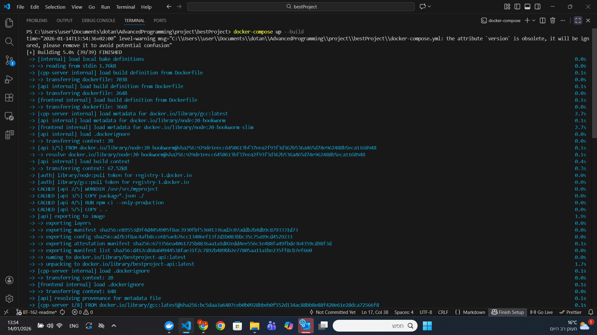
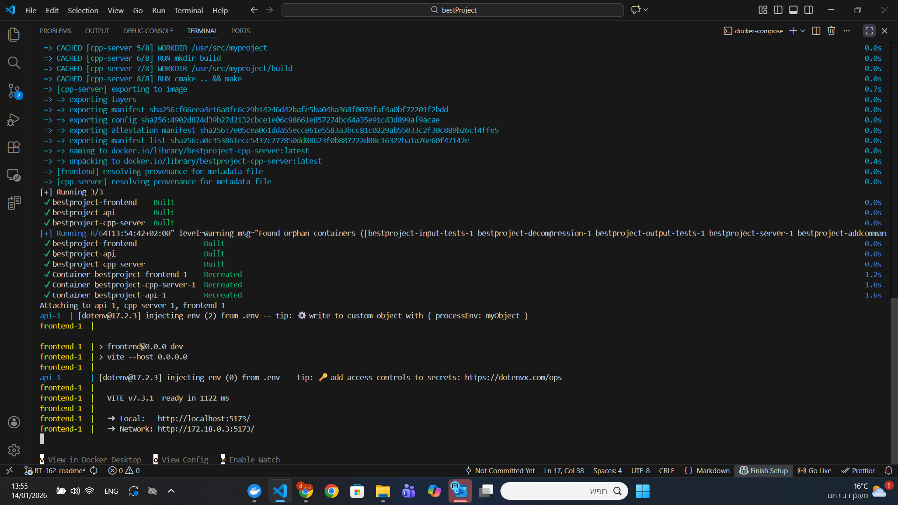

this will setup the cpp server then the webserver and finally the react project  
then go over to http://localhost:5173/ to see the app
there you will be met with this page
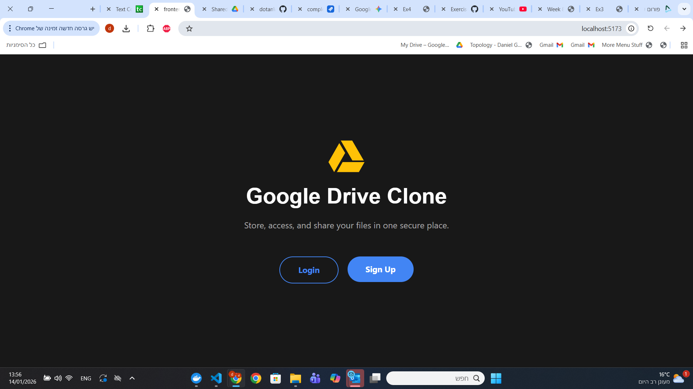  
 we will choose to sign up  
 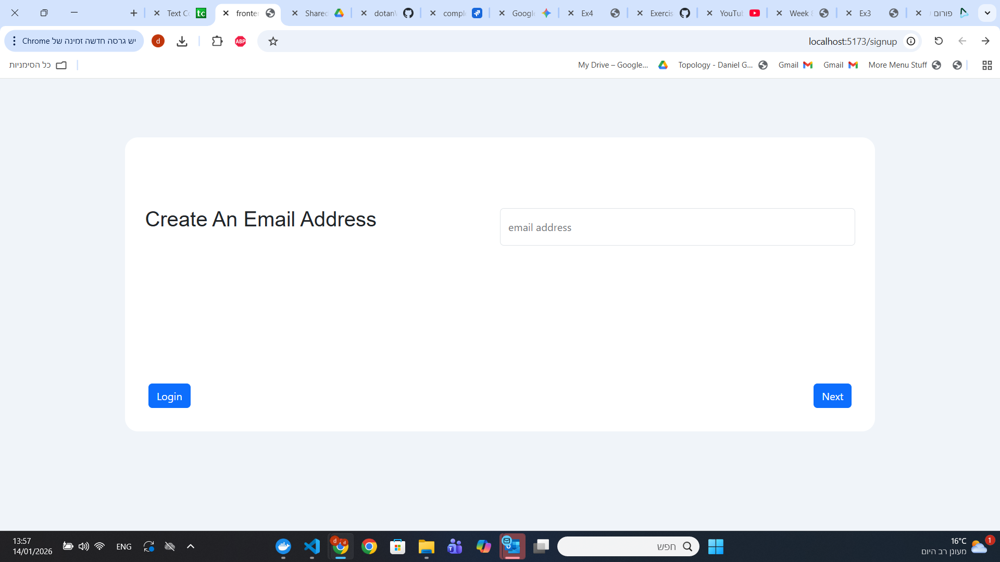  //
   
 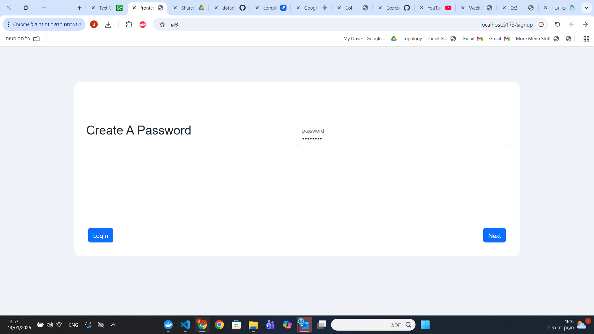
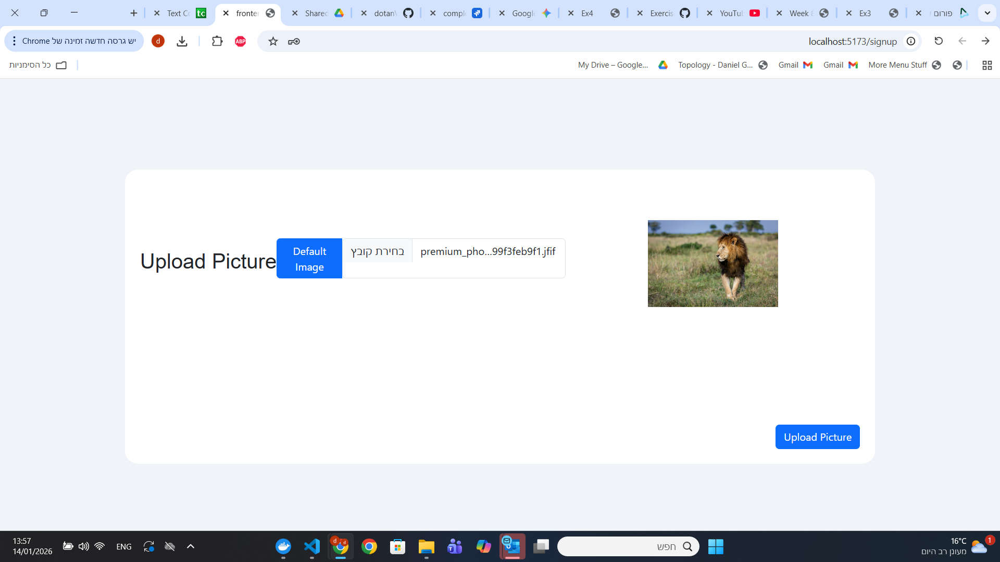
after that we are redirected to the main page
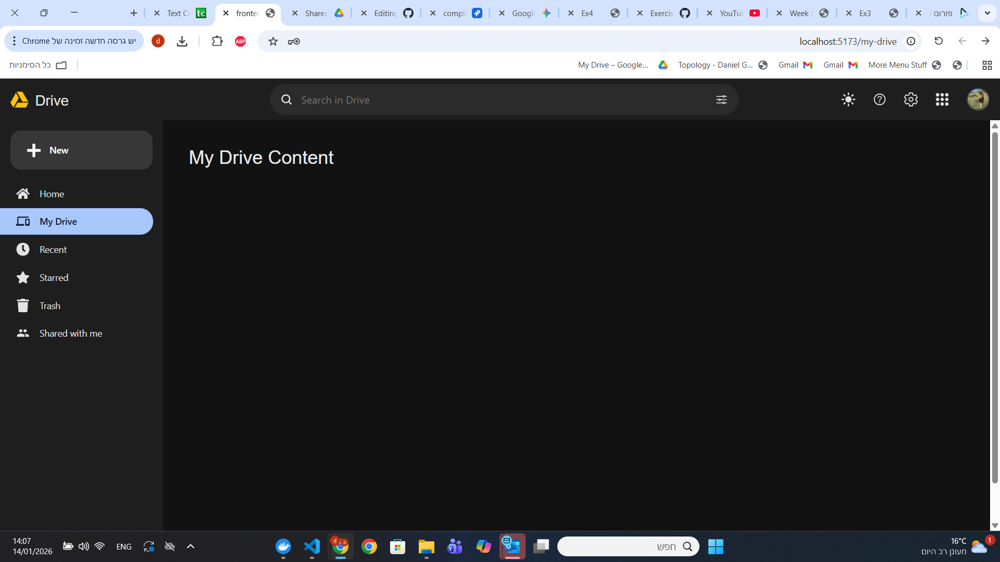
there we can add folders or files
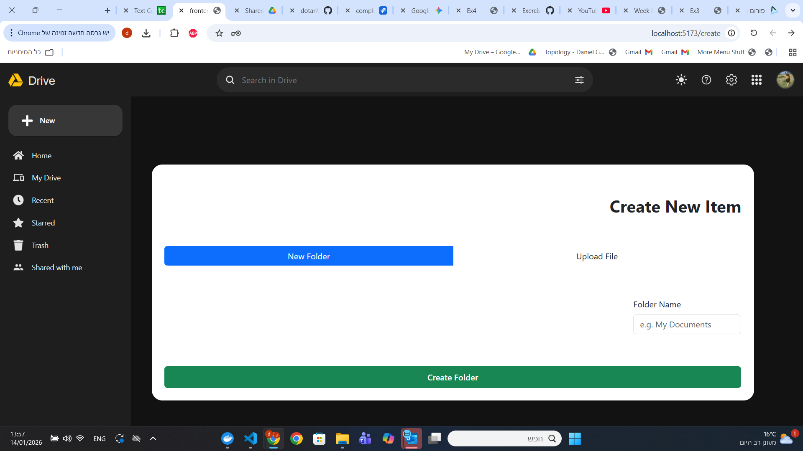
we can go inside and create subfolders or add new files
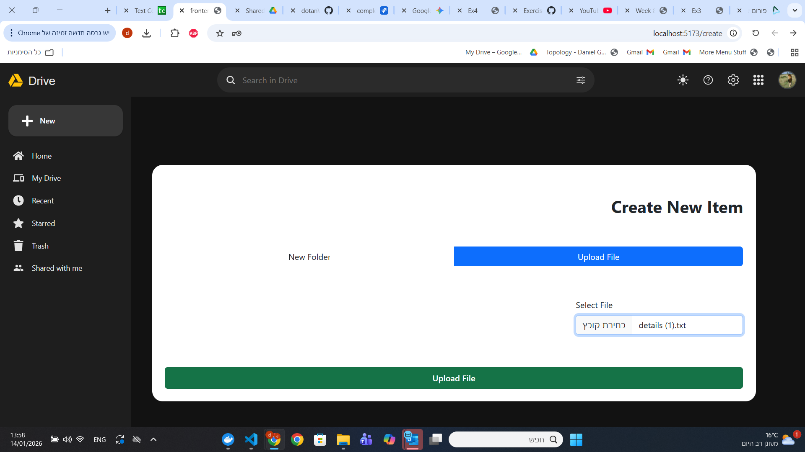

and if we have the right permission we can open the file and even change its content
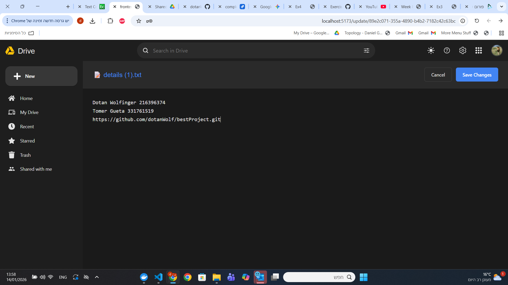

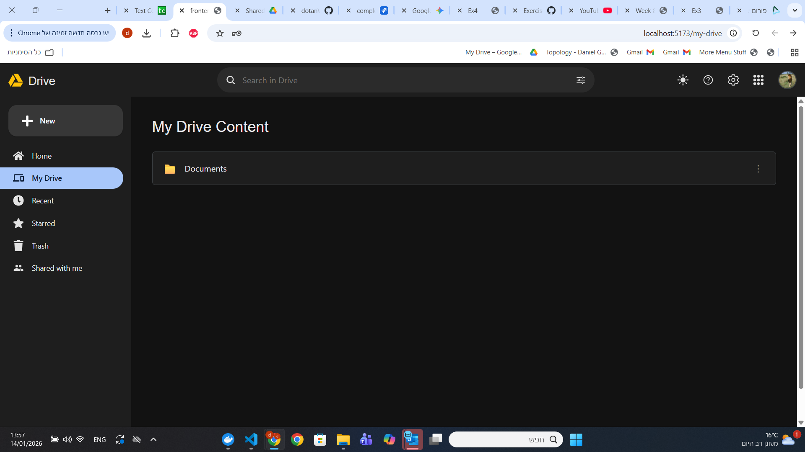
we can click the 3 dots on the right to open all the actions we can preform on this specific entry  
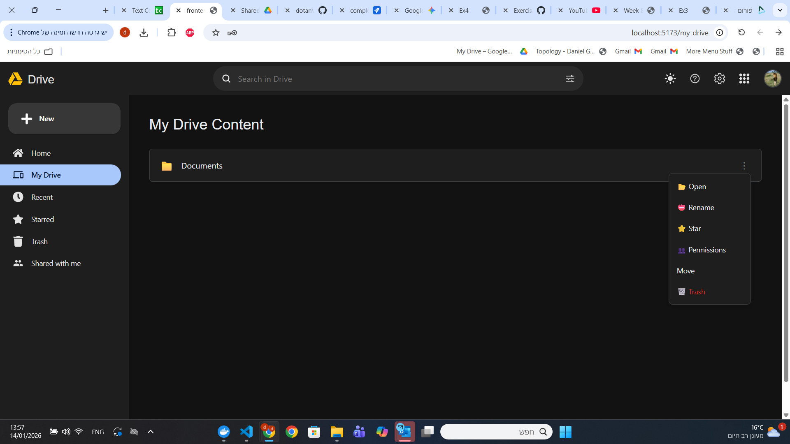
we can share it to our friends  

we can delete it and it will move to the trash page along with its content
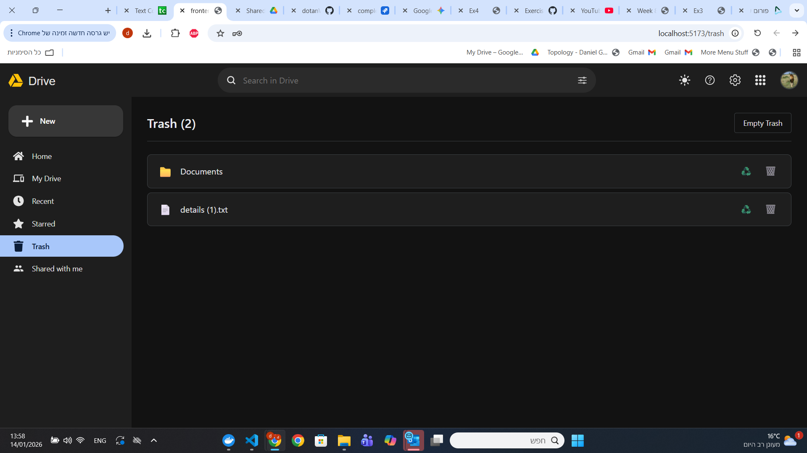
we can star it and unstar it
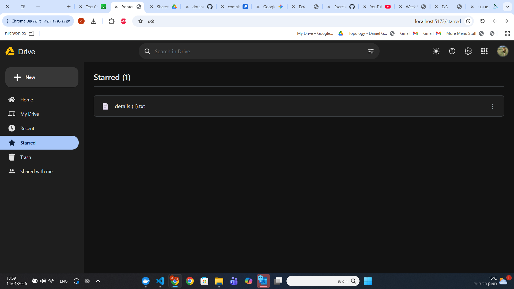

the top ten recently opened files or folders will appear on the recents page
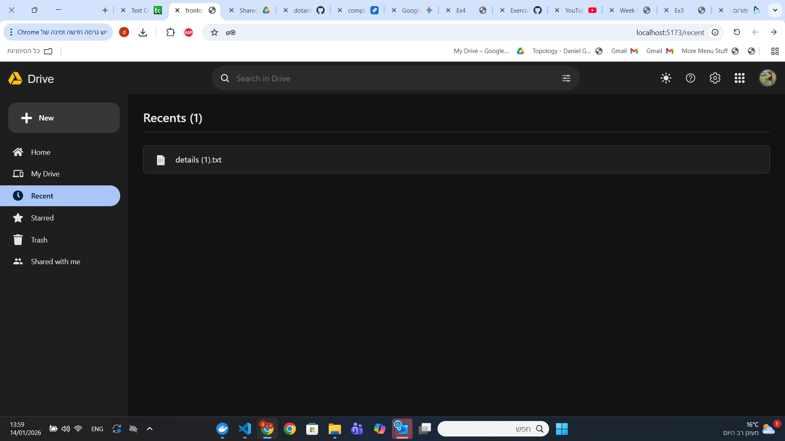

we can enter another users email and give him viewer or editor permissions
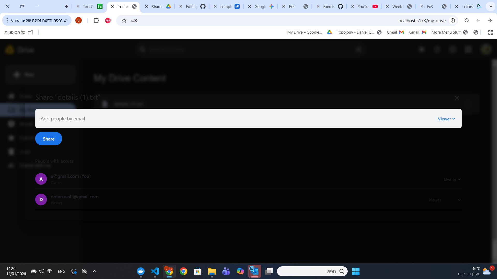
and when he logs in he can see the shared file in his shared with me page
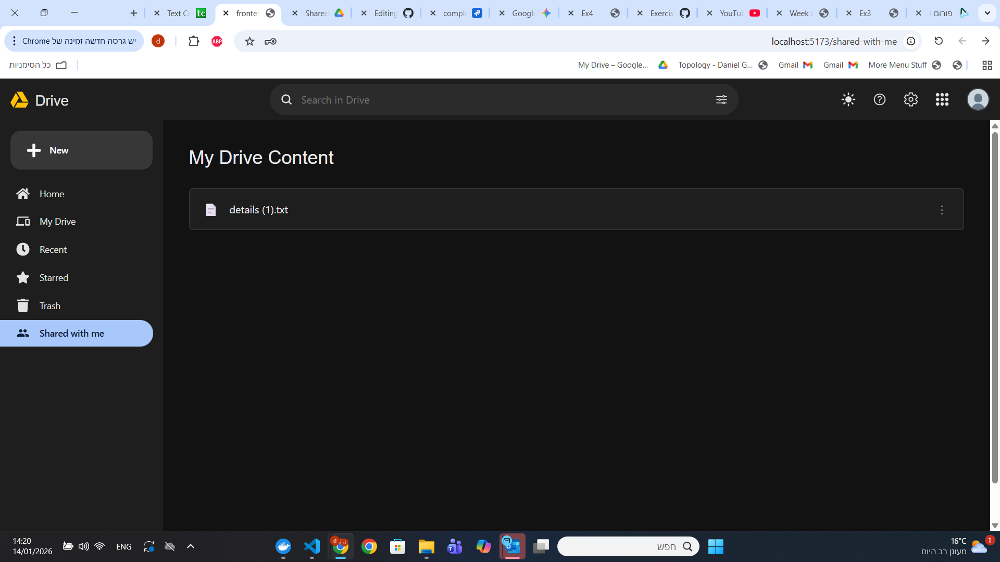

