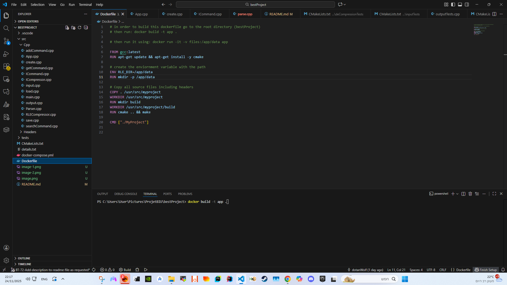
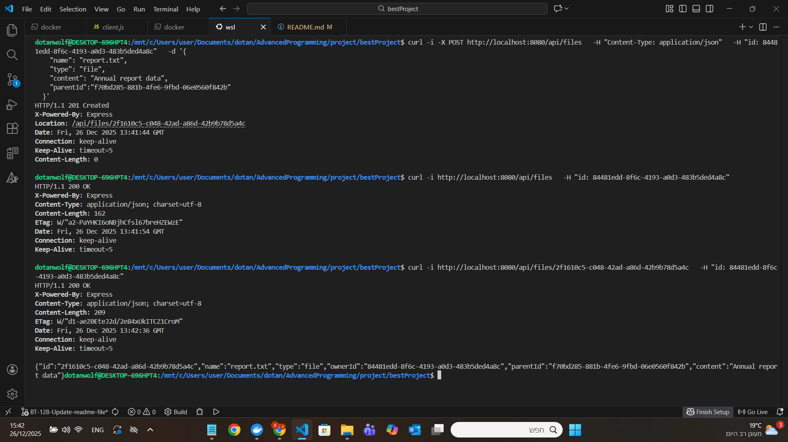
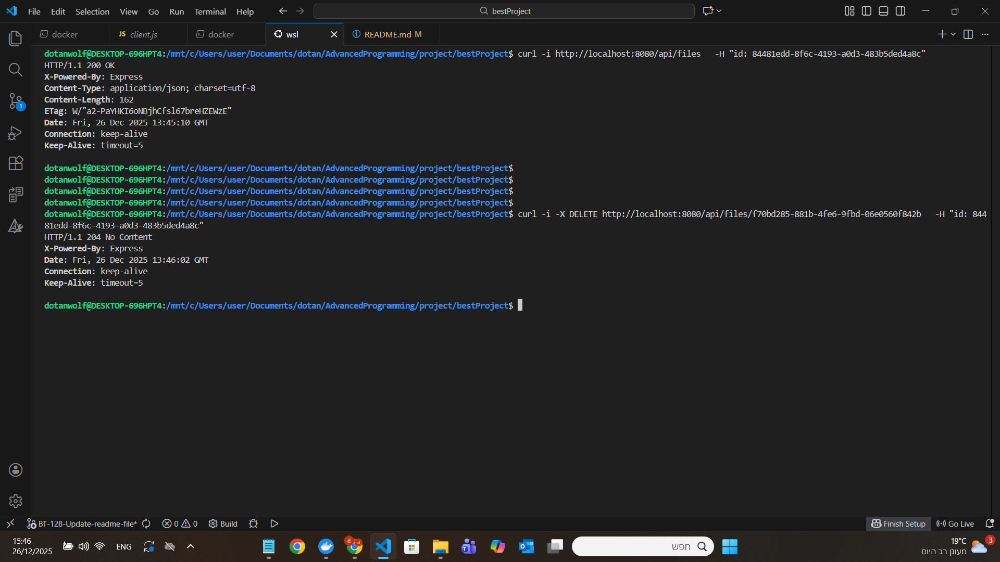
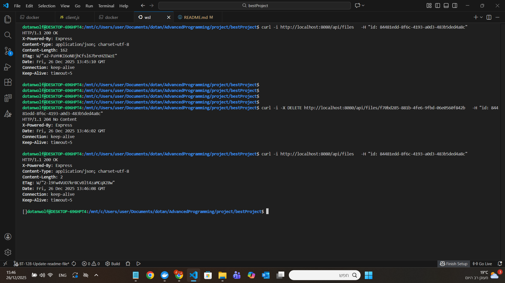

# bestProject
https://github.com/dotanWolf/bestProject.git

about the project-
This project is a Google Drive-style web server built with a Node.js MVC structure that connects to a C++ backend to save files permanently. We developed a RESTful API to serve as the main infrastructure, allowing future clients to easily register, log in, and manage their files.

instruction to run the code:  
use the following commands in the terminal:

for running the cpp server-  
go to the root directory (bestProject)  
then run: docker build -t best-project .  

now for the cpp server-  
run: docker run --init --rm -it -p 9120:9120 -v files:/app/data best-project ./build/MyProject 9120  

For web server (in a new terminal)  
run: docker run --init --rm -it -p 8080:8080 best-project  

Now in a new terminal you can run any curl command  

