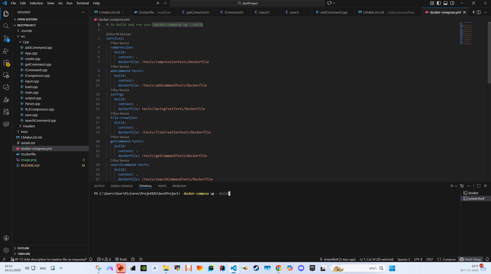
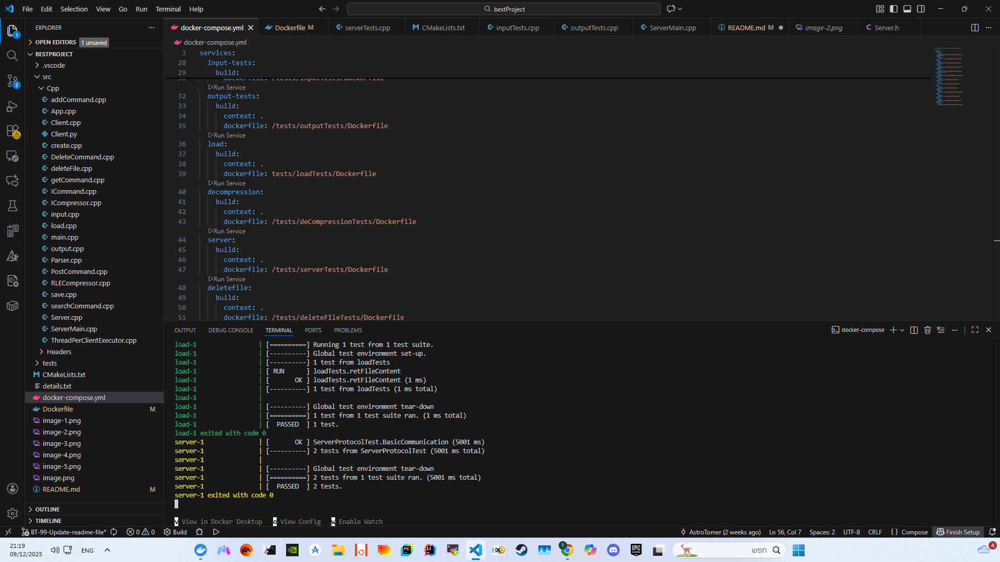
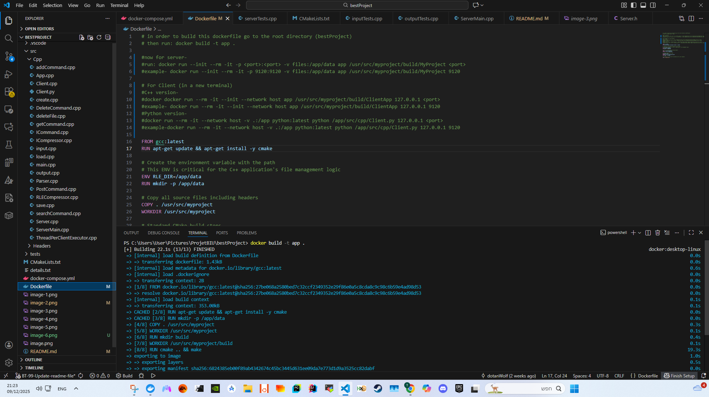
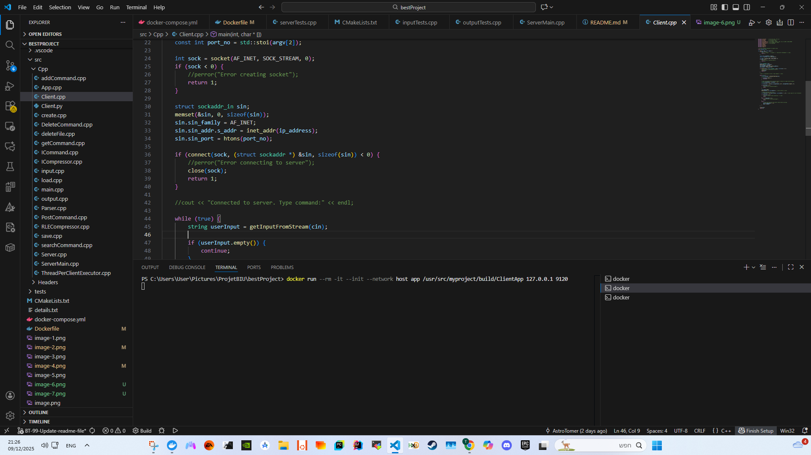
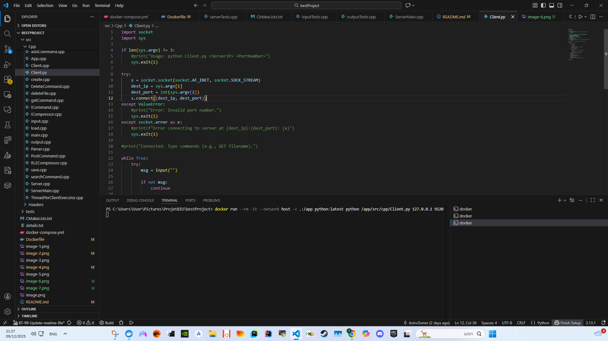
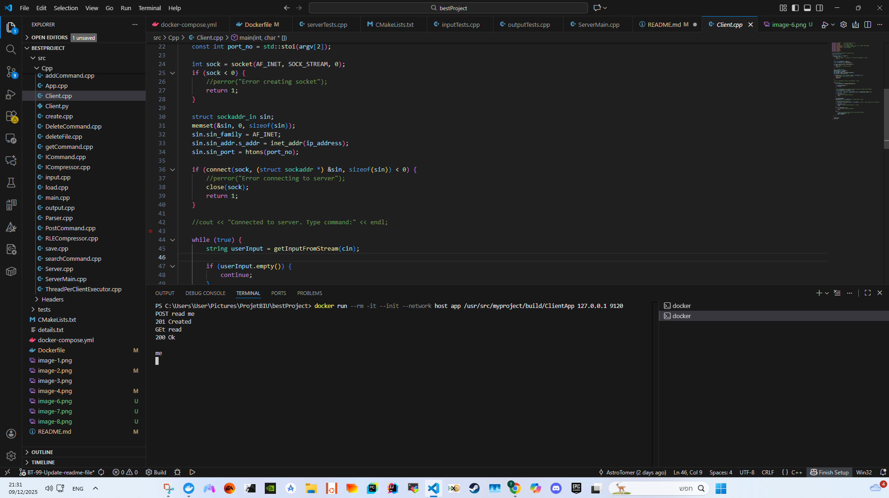
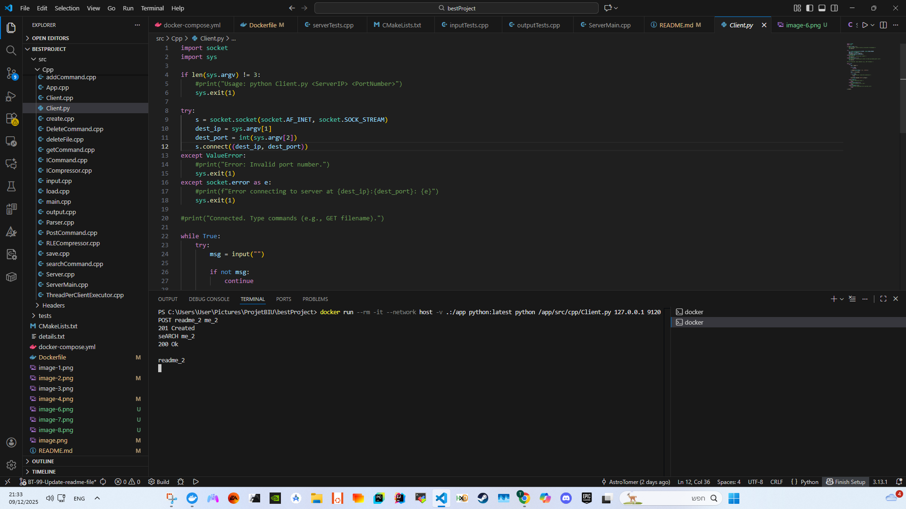
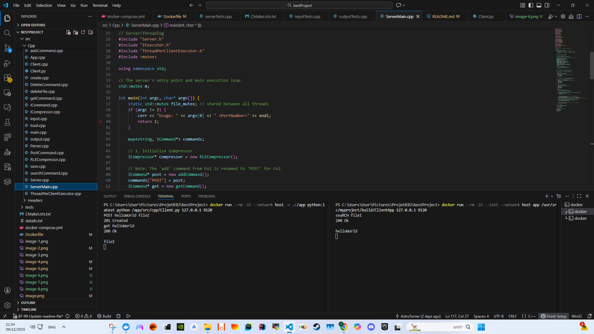

# bestProject
https://github.com/dotanWolf/bestProject.git

instruction to run the code:
use the following commands in the terminal:
for running tests:
go to the root directory (bestProject)
docker-compose up --build

for running the app- 
go to the root directory (bestProject)
then run: docker build -t app .

now for server-
run: docker run --init --rm -it -p <port>:<port> -v files:/app/data app /usr/src/myproject/build/MyProject <port>
example- docker run --init --rm -it -p 9120:9120 -v files:/app/data app /usr/src/myproject/build/MyProject 9120

For Client (in a new terminal)
C++ version-
run: docker run --rm -it --init --network host app /usr/src/myproject/build/ClientApp 127.0.0.1 <port>
example- docker run --rm -it --init --network host app /usr/src/myproject/build/ClientApp 127.0.0.1 9120

Python version-
run: docker run --rm -it --network host -v .:/app python:latest python /app/src/cpp/Client.py 127.0.0.1 <port>
example- docker run --rm -it --network host -v .:/app python:latest python /app/src/cpp/Client.py 127.0.0.1 9120

about the app-
This application is a Command Line Interface (CLI) tool that allows users to add, get and serach files the files saved in comprossed way using RLE compression.

Example of the code running-

Ex2-Questions-

Q1: Did the change in command names require modifying code that should be “closed for modification but open for extension”?

Answer:
Yes, but in a minimal manner.
Our design places each command inside its own class that implements the ICommand interface.
Because of this structure, the name of the command is only mapped at a single place — when inserting the command object into the commands map inside main (ServerMain class).
Changing "add" to "POST" for example did not require modifying any command logic change, altought it did cause a change in the isValid function because instead of expecting "add" as an input we now expect "POST" (Case insensitivity of course).
Those changes were simply added a few lines of code handling case insensitivity and changing command name as needed.
The system remained closed for internal modification while still allowing new names to be introduced by configuration-only changes.

Q2: Did adding new commands require modifying code that should be “closed for modification but open for extension”?

Answer:
No.
The architecture uses the Command Pattern: every new command is added by writing a new class that derives from ICommand.
All existing components — Add, Get, and the other commands — required zero changes.
We simply instantiated the new command and registered it in the commands map.
This demonstrates that the system is open for extension (by adding new commands) while closed for modification (existing classes remain untouched).

Q3: Did the change in command output format require modifying code that should be “closed for modification but open for extension”?

Answer:
Yes, but only minimally and in a controlled way.
The project required all commands to return HTTP-like status messages such as 200 Ok, 404 Not Found, etc.
Because this formatting is part of the command’s responsibility, some command classes were updated to print the correct text.

However, the core framework remained unchanged.
Only the output strings inside each command were updated, which is acceptable because each command owns its own output logic.
Therefore, the Open/Closed Principle was preserved at the architectural level.

Q4: Did switching from console I/O to socket I/O require modifying code that should be “closed for modification but open for extension”?

Answer:
No.
The project already wrapped all output calls through the function printOutput() and handled reads through getInputFromStream().
By using these abstractions, the socket changes were isolated entirely inside Server::HandleClient().

No command logic changed.
No parsing logic changed.

Only the I/O layer was extended to send/receive data via TCP sockets instead of standard input/output.

BY the way (this wasn't a question in the assignment) thanks to our Executor interface implemention we can easily extend our code to use thread pool (As hinted in the assignment, the next exercises may require switching from a “thread-per-client” model to a thread-pool–based executor).